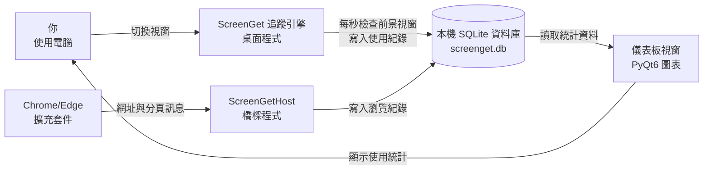

# ScreenGet 架構說明（給非工程師）

> 最後更新：2026/08/06

## 這個專案在做什麼？
ScreenGet 是一個裝在 **Windows** 電腦上的「螢幕使用時間追蹤器」：它會自動記錄你每個程式（例如 Chrome、Word、遊戲）各用了多久，還能把瀏覽器裡逛了哪些網站、各待多久也記下來，然後用儀表板圖表讓你看懂自己的時間花在哪裡。主要使用場景是個人時間管理——想知道自己一天、一週、一個月到底用了哪些 App、逛了哪些網站。

## 怎麼使用？
它不像手機 App 有一個一直開著的畫面，而是「默默在背景記錄、要看時再打開儀表板」：

1. **啟動**：雙擊 `ScreenGet.exe`，程式啟動後會縮到螢幕右下角的**系統匣**（時鐘旁邊的小圖示區），並在背景開始記錄。
2. **看數據**：雙擊系統匣的 ScreenGet 圖示，會打開儀表板視窗，顯示今日／本週／本月的使用統計：總使用時長、各程式排行（Top 5）、24 小時分布圖、每日趨勢圖、日曆（有紀錄的日期會標記）。
3. **看細節**：點儀表板上的「總使用時長」或「瀏覽總時長」卡片，可進入完整排行頁面；另有軟體分析頁、瀏覽器分析頁可看單一程式／網站的使用趨勢。
4. **暫停或退出**：在系統匣圖示上按右鍵，可以手動「暫停／繼續追蹤」，或完全「退出程式」。
5. **關掉視窗 ≠ 停止追蹤**：按儀表板視窗右上角的 X 只會關閉視窗，程式仍會在背景繼續記錄（這是刻意設計，避免漏記）。
6. **開機自動啟動**：在「設定」頁勾選「開機自動執行」，或自己把捷徑放進啟動資料夾。
7. **追蹤瀏覽器網址（選配）**：需另外在 Chrome／Edge 安裝 ScreenGet 擴充套件（開啟「開發人員模式」→「載入未封裝項目」選 `browser_extension` 資料夾），並完成一次性的橋樑註冊（見「怎麼安裝到新裝置」）。裝好後，逛網站會記錄到「網域名稱＋網址」等級。
8. **設定頁**：可切換語言（繁體中文／English／日本語）、開機自動啟動、以及「白名單」——把不想被統計的程式或網站加進去，之後所有統計和圖表都會自動排除它們。

## 系統由哪些部分組成？
這是一個「全部都在你電腦上」的程式，沒有雲端伺服器。它由四大部分組成：

1. **追蹤引擎（核心邏輯）**：一個在背景持續運作的程式引擎，負責「看」你現在正在用哪個視窗。它透過 **Windows API**（微軟提供給程式呼叫系統功能的方法）每秒檢查一次**前景視窗**（目前最上層、正在使用的視窗），認出是哪個程式（例如 `chrome.exe` → 顯示為「Google Chrome」），並記錄開始與結束時間。它也會排除系統背景程式（例如工作管理員、桌面、防毒軟體），只記錄真正在用的東西。
2. **閒置偵測器**：另一個背景引擎，偵測你連續 **20 分鐘**沒有鍵盤滑鼠操作（例如離開座位）時，自動暫停計時；你一回來繼續操作就自動恢復。這樣離開電腦的時間不會被算進「使用時間」。
3. **儀表板（你看到的畫面，也就是**前端**）**：用 **PyQt6**（一個用來畫 Windows 視窗介面的 Python 套件）做的圖形介面，包含首頁統計卡片、排行、圖表、日曆、詳細頁與設定頁。圖表是用 **matplotlib**（畫圖表的 Python 套件）繪製。
4. **資料庫（存放資料的地方）**：用 **SQLite**（一種輕量資料庫，所有資料就是本機的一個檔案）儲存每一段使用紀錄。資料庫檔案放在 `%APPDATA%\ScreenGet\screenget.db`（`%APPDATA%` 是 Windows 專門放應用程式資料的資料夾，通常是你帳號底下的 `AppData\Roaming`）。

另外還有一個**選配**的瀏覽器追蹤子系統：**擴充套件**（安裝在 Chrome／Edge 裡的小程式）偵測分頁切換，透過 **Native Messaging**（瀏覽器與本機程式之間官方的溝通管道）把網址傳給一個叫做 ScreenGetHost 的橋樑程式，橋樑程式再把資料寫進同一個資料庫。這樣就能記錄「逛了哪個網站」而不只是「用了瀏覽器」。

沒有後端伺服器：所有程式碼、資料、圖表都在同一台電腦上完成。

## 資料怎麼流動與儲存？
以「記錄你使用 Chrome 逛 YouTube」為例，完整的資料流是：

1. 你切換到 Chrome 看 YouTube → 追蹤引擎每秒檢查前景視窗，發現前景視窗從別的程式變成 Chrome、視窗標題也變了。
2. 追蹤引擎結束上一段紀錄（寫下結束時間、算出持續秒數），然後在資料庫新增一筆「使用紀錄」（**session**，指一段連續使用的紀錄），記錄：程式名稱、視窗標題、程式路徑、開始時間。
3. 如果你有裝瀏覽器擴充套件：擴充套件偵測到分頁變成 YouTube，把網址傳給 ScreenGetHost 橋樑程式，橋樑程式更新同一筆紀錄，補上網址欄位。
4. 你打開儀表板時，儀表板程式向資料庫查詢今日／本週／本月的所有紀錄，經過分析整理後，把「總使用時長、各程式排行、圖表」畫在畫面上給你看。

資料儲存重點：
- 全部存在本機的 `%APPDATA%\ScreenGet\screenget.db` 一個檔案裡，**不會上傳到任何雲端**（程式碼中未發現任何網路傳輸功能）。
- 資料會**自動清理**：程式每小時檢查一次，刪除超過 **30 天**的舊紀錄。
- 設定（語言、開機啟動、白名單）另外存在同資料夾的 `settings.json`。
- 程式正常或異常結束時，都會把還沒關閉的紀錄補上結束時間，避免資料殘缺。

## 登入與權限（如有）
**無**。ScreenGet 沒有帳號、沒有登入功能、沒有使用者權限區分。任何能操作這台電腦的人都能打開儀表板看全部紀錄。

## 怎麼安裝到新裝置？
**一般使用者（推薦）**：
1. 從 repo 的 `dist` 資料夾取得打包好的執行檔 `ScreenGet.exe`（PyInstaller 打包，內含 Python 環境，不需另外安裝）。
2. 把 `ScreenGet.exe` 複製到新電腦，雙擊即可執行。
3. （選配）瀏覽器網址追蹤需完成三步：a) 在 Chrome／Edge 開啟「擴充功能管理」並啟用「開發人員模式」，用「載入未封裝項目」選 `browser_extension` 資料夾載入擴充套件；b) 複製擴充套件的識別碼（ID），用記事本打開 `dist\com.screenget.host.json`，把 `allowed_origins` 裡的 `REPLACE_WITH_YOUR_EXTENSION_ID` 換成你的 ID；c) 對 `dist\install_host.ps1` 按右鍵「使用 PowerShell 執行」，讓它把橋樑程式註冊進 Chrome 與 Edge。

**開發者（從原始碼執行）**：
1. 安裝 Python（3.11 以上）。
2. `git clone` 這個 repo，在專案資料夾執行 `python -m venv .venv` 建立虛擬環境並啟用。
3. 執行 `pip install -r requirements.txt`（會安裝 PyQt6、psutil、matplotlib 三個套件）。
4. 執行 `python main.py` 啟動。

**重新打包成 exe**：CHANGELOG 顯示是使用 PyInstaller 打包成 `ScreenGet.exe` 與 `ScreenGetHost.exe`，但 repo 內未附打包設定檔（`.spec` 檔被 .gitignore 排除，未提交）。

## 怎麼備份與還原？
- **無自動備份**。程式沒有內建任何備份或匯出／匯入功能（未發現）。
- 要備份的東西其實只有一個資料夾：`%APPDATA%\ScreenGet\`，裡面包含 `screenget.db`（全部使用紀錄）、`settings.json`（設定）、兩個 log 檔（日誌）。
- **手動備份方法**：關閉 ScreenGet 後，把整個 `%APPDATA%\ScreenGet\` 資料夾複製到隨身碟、雲端硬碟或其他位置即可。頻率由你自己決定（資料最久只保留 30 天，超過會被自動刪除，所以若想長期保存歷史，備份要定期做）。
- **還原方法**：把備份的資料夾放回原本的 `%APPDATA%\ScreenGet\` 路徑，重新啟動程式即可。
- 注意：`screenget.db` 使用 WAL 模式（一種避免寫入衝突的資料庫模式），運行中可能同時存在 `screenget.db-wal`、`screenget.db-shm` 兩個暫存檔，備份時最好等程式完全關閉再複製，才能備份到完整資料。

## 外部依賴清單
| 第三方服務 | 用途 | 免費／付費 | 金鑰或帳密放哪裡 | 如果服務倒了或改價會發生什麼 |
|---|---|---|---|---|
| 無雲端服務（未使用任何線上 API、託管平台或雲端資料庫） | — | — | — | — |
| Chrome／Edge 瀏覽器 | 執行 ScreenGet 擴充套件，提供網址追蹤 | 免費 | 無金鑰；擴充套件以「開發人員模式」手動載入，非商店安裝 | 少了網址等級的追蹤，桌面程式與本地紀錄完全不受影響 |
| Python 套件（PyQt6、psutil、matplotlib） | 視窗介面、讀取系統程式資訊、繪製圖表 | 免費開源 | 無（安裝在本機 Python 環境；打包好的 exe 已內含） | 對一般使用者無影響；開發者重新安裝套件即可 |
| Windows 作業系統（Windows API、登錄檔） | 讀取前景視窗、偵測閒置、設定開機自動啟動 | 內建免費 | 無 | 程式只能在 Windows 上執行，其他系統無法使用 |
| SQLite | 本機資料庫 | 內建免費 | 無 | 無（內建於 Python，隨程式一起） |

## 風險提醒
| 風險項目 | 是否適用 | 目前怎麼處理 | 殘留風險 |
|---|---|---|---|
| API 金鑰／密碼外洩 | 否 | 程式碼中未發現任何 API 金鑰、密碼或機密資訊，也不呼叫任何外部服務 | 無 |
| 資料是否公開 | 是 | 使用紀錄只存在本機資料夾，程式碼中未發現任何上傳功能；但 GitHub repo 本身是**公開**的，任何人都能下載程式碼 | 若本機資料夾被他人存取（共用電腦、被入侵），所有使用紀錄會被看到；程式碼公開不影響資料 |
| 個人資料蒐集 | 是 | 程式會記錄：程式名稱、視窗標題、程式路徑、瀏覽網址、使用起止時間，全部只存本機、30 天後自動刪除 | 視窗標題與網址可能包含個人敏感資訊（例如信件標題、網頁內容關鍵字）；雖然不上傳，但本機檔案是明文，任何人拿到該檔案都能讀 |
| 備份與還原缺口 | 是 | 無自動備份、無匯出／匯入功能；資料 30 天自動清理 | 硬碟壞掉或誤刪 `screenget.db` 會永久遺失全部歷史；超過 30 天的資料無法找回 |
| 金流相關 | 否 | 程式不涉及任何金錢交易、付款或訂閱 | 無 |
| 資料庫刪除或遷移 | 是 | 30 天自動清理是程式內建的設計行為（每小時檢查）；啟動時會自動修補未關閉的紀錄 | 若要換電腦，需手動複製資料庫檔案；沒有遷移工具；自動清理無法關閉（設定中未發現保留天數選項） |
| 部署與網路暴露 | 否 | 純本機桌面程式：不開伺服器、不監聽網路埠、無任何對外連線 | 無 |
| 日誌含敏感資訊 | 是 | 日誌檔（`%APPDATA%\ScreenGet\screenget.log` 與 `native_host.log`）會記錄視窗標題、網址、偵測到的程式名稱，寫在本機明文檔案 | 日誌內容等同使用紀錄，且無輪替機制（未發現大小上限或自動刪除），長期使用會累積大量個人資訊在本機 |

## 壞了怎麼辦？
程式沒有自動重啟、監控告警或健康檢查，但程式碼內建了一些自我修復機制（見下方）。出問題時依序檢查：

1. **程式沒在記錄**：先看系統匣有沒有 ScreenGet 圖示。沒有就重新雙擊 `ScreenGet.exe`。啟動後系統匣會顯示「⚡ 追蹤中」或「😴 閒置中」的提示文字。
2. **看日誌找原因**：用記事本打開 `%APPDATA%\ScreenGet\screenget.log`，看最後幾行有沒有錯誤訊息。
3. **儀表板沒資料或數字怪怪的**：確認追蹤沒被暫停（系統匣右鍵→「已繼續追蹤」）、確認資料庫檔案 `%APPDATA%\ScreenGet\screenget.db` 存在且大小不是 0。
4. **瀏覽器網址沒被記錄**：確認擴充套件有載入（瀏覽器右上角有沒有 ScreenGet 圖示）、`com.screenget.host.json` 裡的擴充套件 ID 是否正確、是否已執行過 `install_host.ps1`。擴充套件與橋樑斷線時會每 5 秒自動嘗試重連。
5. **資料庫疑似壞掉**：先完全退出程式，把 `screenget.db` 改名（例如 `screenget.db.bak`）再重新啟動，程式會自動建立一個全新的資料庫——但**舊資料會留在 .bak 檔裡不會自動恢復**，可考慮手動用 SQLite 工具搶救。

程式內建的自我修復機制：
- 追蹤引擎與閒置偵測器的背景迴圈都有錯誤捕捉，單次錯誤不會讓程式崩潰，會寫進日誌後繼續跑。
- 啟動時會自動把上次異常結束沒關閉的紀錄補上結束時間（`close_all_open_sessions`）。
- 資料庫使用 WAL 模式並設定寫入逾時，降低寫入衝突與損壞機率。
- 瀏覽器擴充套件斷線後每 5 秒自動重新連接。

## 架構圖

（此架構完全在本機運作，**沒有任何雲端節點**；`E→F→C` 這條瀏覽器追蹤鏈為選配）

## 名詞對照表
| 專有名詞 | 白話解釋 |
|---|---|
| 前端 | 你看到的畫面，這裡指儀表板視窗 |
| 後端 | 背後處理資料的程式邏輯（ScreenGet 的前端與後端都在同一台電腦上） |
| 資料庫 | 存放資料的地方，ScreenGet 用 SQLite 把所有紀錄存成一個檔案 |
| SQLite | 一種輕量資料庫，不需要另外安裝伺服器，資料就是本機的一個檔案 |
| API | 程式之間互相呼叫的『服務窗口』；Windows API 是微軟提供給程式呼叫系統功能的方法 |
| 系統匣 | 螢幕右下角、時鐘旁邊的小圖示區 |
| 前景視窗 | 目前最上層、你正在使用的那個視窗 |
| Session（使用紀錄） | 一段連續使用的紀錄，從你切換到某程式開始，到你切走為止 |
| 輪詢 | 程式每隔固定時間自動檢查一次（這裡是每秒檢查一次前景視窗） |
| 執行緒 | 程式裡同時在跑的小工段，讓追蹤與介面互不干擾 |
| 擴充套件 | 安裝在瀏覽器裡的小程式（Chrome／Edge 的 ScreenGet 擴充套件） |
| Native Messaging | 瀏覽器與本機程式之間官方的溝通管道 |
| PyQt6 | 用來畫 Windows 視窗介面的 Python 套件 |
| matplotlib | 畫圖表的 Python 套件 |
| psutil | 讀取系統程式資訊（名稱、路徑）的 Python 套件 |
| 白名單 | 使用者指定不想被統計的程式或網站清單，加入後會從所有統計中排除 |
| 登錄檔 | Windows 紀錄設定的地方，開機自動啟動就是寫在這裡 |
| PyInstaller | 把 Python 程式打包成 exe 執行檔的工具 |
| WAL 模式 | 資料庫的一種寫入方式，可避免同時讀寫時鎖死、降低損壞機率 |
| `%APPDATA%` | Windows 放應用程式資料的資料夾（通常是 `C:\Users\<你的帳號>\AppData\Roaming`） |
